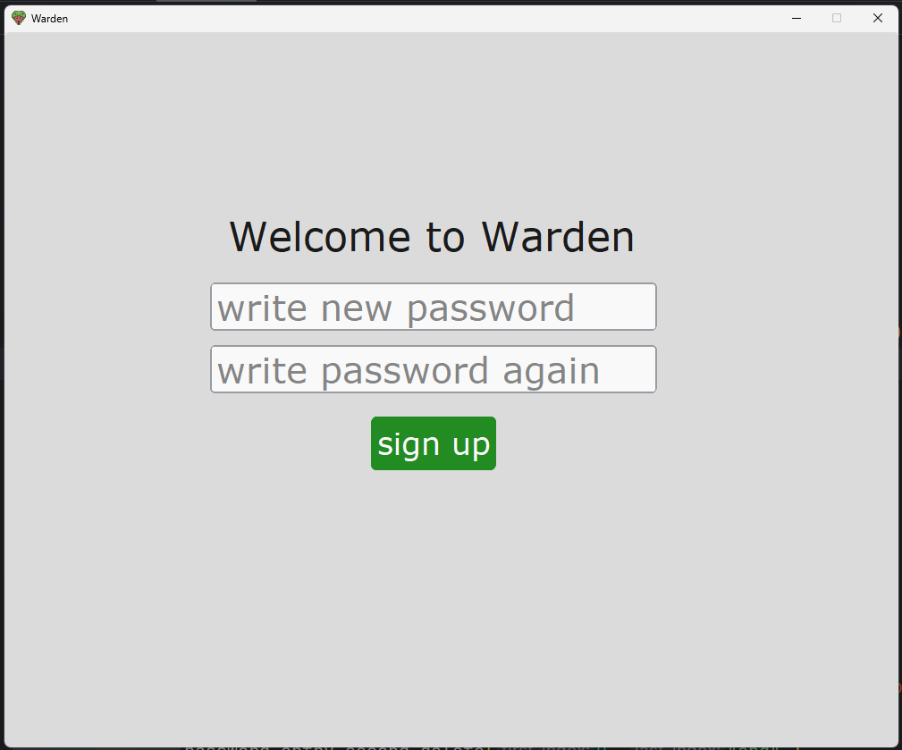
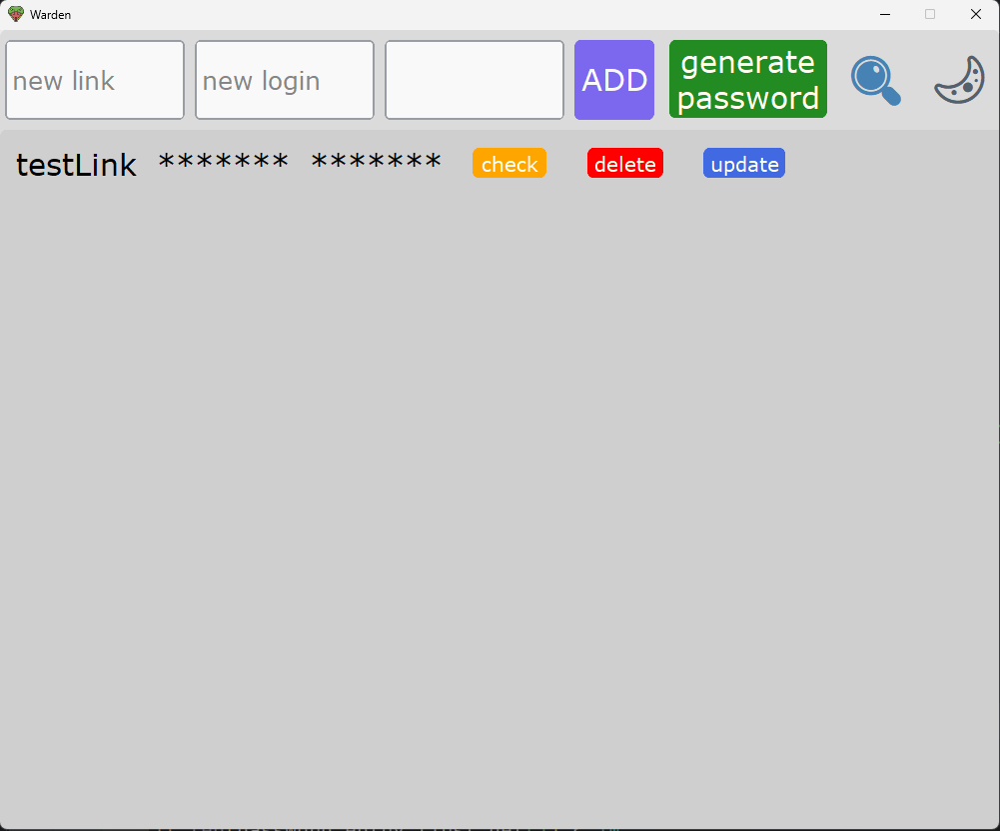
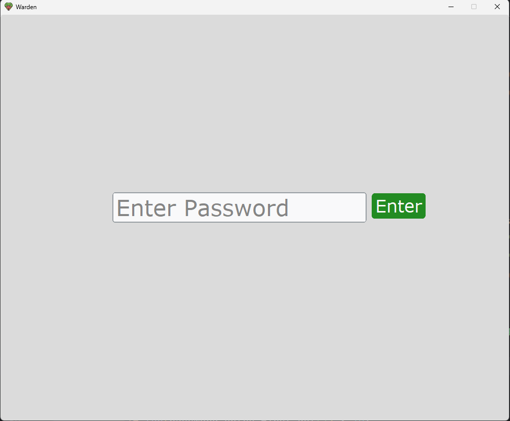

#                          Warden 

### This is a password manager - it is necessary for encryption and access to your passwords.

## Tech Stack
- python 3.14
- cryptography
- sqlite
- customykinter

## Installation
  ```thoroughly scan your computer for malware (especially Trojans and keyloggers)```
  
  
  ```To ensure proper operation, place the .exe file along with the icon.png```,  
    
  or build it yourself using pyinstaller - use command:  

  ```git clone https://github.com/BugganeHuman/Warden```
  
  ```pip install pyinstaller```

  ```pip install cryptography```
  
  ```pip install customtkinter```

  ```pyinstaller --onefile --windowed --icon=icon.ico main.py```

## Project Structure
  - logics.py - functions related to the project logic are stored
  - operations.py - functions associated with elements are stored
  - main.py - the interface is stored

## Features
  - This is a password manager that is easy to understand but highly secure,
  meaning you can literally read the written code and rewrite it to suit
  your needs (which you can't do with large-scale password managers because 
  it's long and complicated), meaning if you have special preferences like
  5,000,000 iterations or special checks.

  - Fully local storage (no cloud)

  - UI can be adjusted without touching cryptographic logic

  - Codebase is small and readable

  - Security parameters are explicit and configurable
  

## Recommendations For Use
  - Be sure to make backups
  because even if an attacker can't decrypt the database with passwords,
  he can simply delete the database file.

  - Do not store your master password anywhere.

  - Do not manually change the database file,
  as this may break the entire structure and you will lose access.

  - Before actual use, make sure that your device is free of keyloggers or other viruses.

  - When you enter your master password, make sure no one is spying on your hands.

## Changing the Master Password

  The app does not support changing the master password in-place.

  If you need to change the master password:
  1. Download the app to a different location.
  2. Manually migrate records from the old database through the app.
  3. Test the new database.
  4. Securely delete the old one.

## Screenshots







